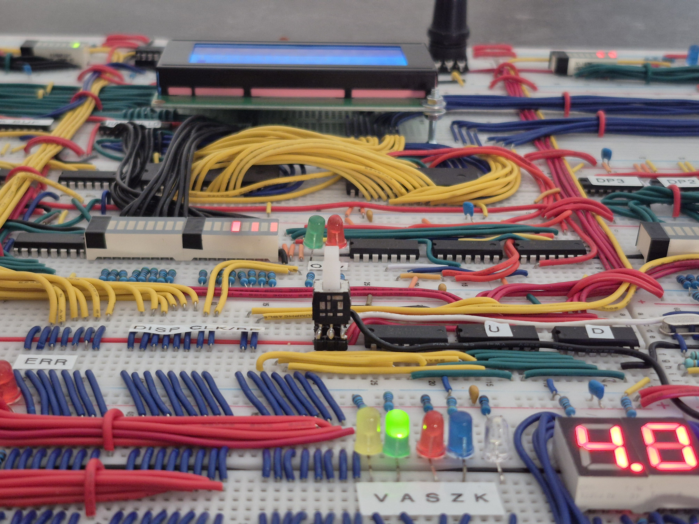

# Synapse-191: A Native Brainf*ck Computer align="center"><kbd></kbd>

## Overview

**Synapse-191** is a fully functional 8-bit computer that executes Brainf\*ck (BF) programs *natively* on a breadboard CPU built entirely from TTL logic. The system is capable of running canonical Brainf*ck code directly from ROM and includes a supporting toolchain for assembling and flashing programs.

For detailed design information, schematics, and background, refer to the accompanying report:  
**[Full Project Report (PDF)](./doc/report.pdf)**

---

## Project Goals

The goal of this project was to implement a working CPU that runs Brainf*ck programs *directly in hardware* — without any compilation or interpretation layers — using only discrete logic components.

- Implemented on **solderless breadboards**.
- Built entirely from **74LS-series TTL logic**.
- Only one **microcontroller** (Atmega328P) is used — exclusively for **I/O management** (LCD, keyboard, RNG).
- **Minimal preprocessing:** each Brainf*ck instruction maps directly to a hardware opcode; additional non-BF instructions generated by the assembler are used only for **initialization and system control** (NOP, INIT, WAIT\_EXT, ERR, HLT).
- **No loop-address preprocessing:** loop behavior is handled natively by the CPU logic.

---

## System Features

- Supports up to **16K Brainf*ck instructions** in program memory.
- **64K-cell data tape** with **256-byte stack** for loop-address storage.
- **Advanced I/O system** supporting:
  - Keyboard input and LCD output.
  - Random number generation.
  - Multiple output and input modes (ASCII, hexadecimal, etc).
- **Adjustable clock** frequency from single-step to ~250 kHz.
- **Live frequency display** showing both clock rate and executed BF instructions per second.

<kbd></kbd>

---

## Repository Contents

### Core Tools

| Tool | Description |
|------|--------------|
| **bfasm** | Assembler for Brainf*ck programs. Translates BF source code into a binary image for the Synapse-191 CPU. |
| **bflash\.py** | EEPROM programming utility used to flash assembled binaries onto physical ROM chips; communicates over serial with an Arduino Nano. |
| **programmer firmware** | Firmware for the Arduino Nano that is used to program the EEPROM chips; communicates over serial with the **bflash\.py** script. |
| **io firmware** | Firmware for the Atmega328P-based I/O module. Handles the LCD display, PS/2 keyboard, random number generation, and I/O protocol. |

### External Repositories

| Repository | Description |
|-------------|--------------|
| **[Rinku](https://github.com/jorenheit/rinku)** | C++ library used to emulate and test hardware modules and microcode logic during development. |
| **[Mugen](https://github.com/jorenheit/mugen)** | Microcode compiler used to generate the control ROM images for the CPU. These are programmed once during construction. |

---

## Typical Workflow

1. Write a program in Brainf*ck (`.bf` file).
2. Assemble it using **bfasm** to produce a binary image.
3. Flash the binary to a ROM chip (using **bflash** or any other utility to program EEPROM chips).
4. Insert the ROM into the computer and execute the program.

---

## Documentation

See the [full PDF report](./doc/report.pdf) for:

- Background on Brainf*ck.
- Complete architecture and subsystem overview.
- Control logic and microcode design.
- I/O subsystem and firmware.
- Implementation photos and schematics.
- Conclusion and results.

---

© 2025 Joren Heit — Synapse-191 Project
